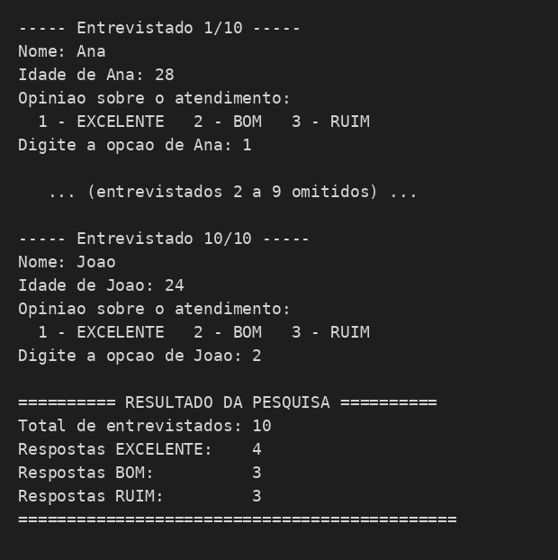

# Pesquisa de Opinião - TudoWeb

Programa em Python desenvolvido para a empresa fictícia TudoWeb, que coleta, por meio de estrutura de repetição, a opinião de clientes sobre o atendimento prestado e exibe ao final a quantidade de respostas **EXCELENTE** e **RUIM**.

## Regras da pesquisa

Para cada entrevistado, o programa solicita:

- Nome
- Idade
- Opinião sobre o atendimento:
  - `1` - EXCELENTE
  - `2` - BOM
  - `3` - RUIM

A pesquisa completa é feita com **50 entrevistados**. Ao final, o programa exibe:

- Quantidade de respostas EXCELENTE
- Quantidade de respostas RUIM

## Arquivos do projeto

| Arquivo                  | Descrição                                                                 |
|---------------------------|----------------------------------------------------------------------------|
| `pesquisa_opiniao.py`     | Programa principal, executa a pesquisa completa com 50 entrevistados.      |
| `teste_pesquisa_10.py`    | Script de teste, reaproveita as funções do programa principal para validar o funcionamento com apenas 10 entrevistados. |

## Como executar

Pré-requisito: [Python 3](https://www.python.org/) instalado.

Pesquisa completa (50 entrevistados):
```bash
python3 pesquisa_opiniao.py
```

Teste rápido (10 entrevistados):
```bash
python3 teste_pesquisa_10.py
```

### Exemplo de execução

```
----- Entrevistado 1/10 -----
Nome: Ana
Idade de Ana: 28
Opinião sobre o atendimento:
  1 - EXCELENTE
  2 - BOM
  3 - RUIM
Digite a opção de Ana: 1

...

========== RESULTADO DA PESQUISA ==========
Total de entrevistados: 10
Respostas EXCELENTE:    4
Respostas BOM:          3
Respostas RUIM:         3
=============================================
```

## Estrutura do código

- `obter_idade(nome)` — solicita e valida a idade digitada (aceita apenas números inteiros não negativos).
- `obter_opiniao(nome)` — exibe o menu de opções e valida a opinião digitada (aceita apenas 1, 2 ou 3).
- `coletar_pesquisa(quantidade)` — laço de repetição (`for`) que coleta os dados de todos os entrevistados e usa estrutura de decisão (`if/elif/else`) para contabilizar cada tipo de resposta.
- `exibir_resultado(...)` — imprime o resultado final da pesquisa de forma organizada.
- `main()` — coordena a execução do programa.

O script de teste (`teste_pesquisa_10.py`) importa e reutiliza essas mesmas funções, apenas alterando a quantidade de entrevistados, evitando duplicação de código entre a versão de teste e a versão final.

## Conceitos aplicados

- Estrutura de repetição (`for`)
- Estrutura de decisão (`if/elif/else`)
- Validação de entrada de dados (`while`, `isdigit`)
- Programação estruturada em funções
- Reaproveitamento de código entre módulos (`import`)

## Prints de funcionamento



## Autor

Atividade desenvolvida por Nicholas Souza.
